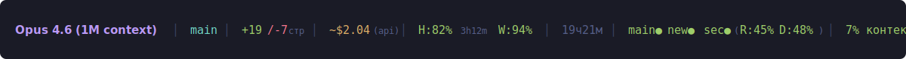

# claude-statusline

Умный status line для [Claude Code](https://docs.anthropic.com/en/docs/claude-code) — видишь модель, стоимость, контекст и состояние VPS прямо во время работы.

```
Opus │ main* │ +156/-23 │ ~$1.65(api) │ H:78% 2h15m W:92% │ 12мин │ main●(R:42% D:55%) new● sec● │ 42% контекст
```

**Без Node.js. Без npm. Чистый bash + jq.**



## Установка

Запусти Claude Code (`claude` в PowerShell/терминале) и скажи ему:

```
Клонируй https://github.com/CreatmanCEO/claude-statusline и установи через install.sh --ru
```

Или выполни в Claude Code вручную:

```bash
git clone https://github.com/CreatmanCEO/claude-statusline.git ~/claude-statusline && bash ~/claude-statusline/install.sh --ru
```

Перезапусти Claude Code. Статус-линия появится автоматически.

> **Важно:** установка работает из Claude Code или Git Bash. Из PowerShell/cmd напрямую — нет (там нет bash).

## Что показывает

- **Модель** — Opus / Sonnet / Haiku
- **Git** — ветка + `*` если есть незакоммиченные изменения
- **Строки кода** — сколько добавлено/удалено за сессию
- **Стоимость** — подписка (Max/Pro/Team) → теоретическая `~$1.65(api)`, API → реальная `$0.14`
- **Лимиты H/W** — остаток 5-часовой и недельной квоты: `H:78% 2h15m W:87%` с цветовой индикацией
- **Контекстное окно** — цвет меняется: 🟢 <50% 🟡 50-70% 🔴 >70% с подсказкой `/compact!`
- **VPS-мониторинг** — состояние серверов в реальном времени (подробности ниже)

## Настройка VPS-мониторинга

### Шаг 1 — добавить серверы

Скажи Claude Code:

```
Открой ~/.claude/statusline.conf и добавь в конец:

SHOW_VPS=remote
VPS_SERVERS=(
  "main|95.85.234.200|22|root|~/.ssh/claude_vps"
  "new|95.85.235.189|22|root|~/.ssh/claude_vps"
  "sec|178.17.50.45|22|root|~/.ssh/claude_vps_key"
)
```

Замени IP, юзеров и пути к ключам на свои.

### Шаг 2 — запустить поллер

Скажи Claude Code:

```
Запусти ~/claude-statusline/vps-poller.sh start
```

Поллер работает в фоне, опрашивает серверы каждые 30 секунд по SSH. В статус-линии появятся точки: `main● new● sec●`

**Статусы:**
- 🟢 `●` — всё ОК
- 🟠 `◉` — RAM/CPU/Disk > 80% (подробности развёрнуты)
- 🔴 `✗` — сервер не отвечает
- 🟣 `↻` — только перезагрузился

### Шаг 3 — авто-фокус активного VPS

Когда работаешь с сервером через MCP SSH, statusline автоматически показывает его метрики. Остальные — только точки.

Скажи Claude Code:

```
Добавь в ~/.claude/statusline.conf:

VPS_FOCUS=auto
VPS_MCP_MAP=(
  "main|vps-main"
  "new|vps-new"
  "sec|vps-secondary"
)
```

Левая часть — имя сервера из `VPS_SERVERS`. Правая — имя MCP-подключения в Claude.

Результат: работаешь с `vps-main` → `main● R:42% D:55% │ new● │ sec●`. Переключился на `vps-secondary` → `main● │ new● │ sec● R:61% D:70%`

## Управление поллером

Скажи Claude Code:

```
~/claude-statusline/vps-poller.sh status    # проверить работает ли
~/claude-statusline/vps-poller.sh stop      # остановить
~/claude-statusline/vps-poller.sh start     # запустить
~/claude-statusline/vps-poller.sh once      # одноразовый опрос (для теста)
```

## Другие варианты установки

В Claude Code:

```bash
bash ~/claude-statusline/install.sh --ru --tmux   # + tmux интеграция (popup по Prefix+y)
bash ~/claude-statusline/install.sh --minimal      # только модель + контекст
bash ~/claude-statusline/install.sh --uninstall    # удалить
```

## Настройка конфига

Все параметры в `~/.claude/statusline.conf`. Изменения подхватываются автоматически — перезапуск не нужен.

Чтобы посмотреть или изменить, скажи Claude Code:

```
Покажи мой ~/.claude/statusline.conf
```

Основные параметры:

| Параметр | Значение | Что делает |
|----------|----------|------------|
| `SHOW_MODEL` | true/false | Имя модели |
| `SHOW_COST` | true/false | Стоимость |
| `SHOW_CONTEXT` | true/false | Процент контекста |
| `SHOW_LINES` | true/false | +/- строки кода |
| `SHOW_DURATION` | true/false | Время сессии |
| `SHOW_GIT` | true/false | Git branch |
| `SHOW_TOKENS` | true/false | Токены (input → output) |
| `SHOW_VPS` | false/remote/local | VPS-мониторинг |
| `SHOW_LIMITS` | true/false | Лимиты H/W (5ч/7д квоты) |
| `LANG_RU` | true/false | Русские подписи |
| `CONTEXT_WARN` | 50 | % контекста → жёлтый |
| `CONTEXT_CRIT` | 70 | % контекста → красный |

## Если не отображаются лимиты H/W

Лимиты требуют OAuth-токен. Если `H:` и `W:` не появились:

1. Убедись что залогинен: выполни `claude login` если ещё не делал
2. Скажи Claude Code:
```
Проверь есть ли файл ~/.claude/.credentials и покажи его первые 50 символов
```
3. На Windows токен может быть в другом месте. Скажи Claude Code:
```
Поищи файл .credentials в $APPDATA/claude/ и $LOCALAPPDATA/claude/ и ~/.claude/
```

Если токен не найден — лимиты тихо пропускаются, остальное работает нормально. Можно отключить: `SHOW_LIMITS=false` в конфиге.

## Полезные slash-команды Claude Code

- `/cost` — стоимость сессии и токены
- `/context` — детальная разбивка контекстного окна
- `/compact` — сжать контекст (когда статус-линия красная)
- `/model sonnet` — переключить модель

## Платформы

| | Статус | Метрики | tmux |
|---|---|---|---|
| **Linux** | ✅ | ✅ | ✅ |
| **macOS** | ✅ | ✅ | ✅ |
| **Windows (через Claude Code)** | ✅ | ✅ | — |

## Зависимости

- `bash` 4+, `jq` (обязательно)
- `git`, `tmux`, `ssh` (опционально)

---

## English

Smart status line for Claude Code — model, cost, context %, VPS health at a glance.

### Install

Run inside Claude Code:
```bash
git clone https://github.com/CreatmanCEO/claude-statusline.git ~/claude-statusline && bash ~/claude-statusline/install.sh
```

### Features
- Model, git branch, lines changed, context % with color coding (green → yellow → red)
- Usage limits H/W: remaining 5-hour and 7-day quotas with time until reset
- API cost: theoretical for subscribers (Max/Pro/Team), real for API users
- Remote VPS monitoring via background SSH poller with auto-focus on active MCP server
- tmux integration with status bar bridge + popup window

### VPS monitoring
Add to `~/.claude/statusline.conf`:
```bash
SHOW_VPS=remote
VPS_SERVERS=("prod|1.2.3.4|22|root|~/.ssh/key")
VPS_FOCUS=auto
VPS_MCP_MAP=("prod|my-mcp-server")
```
Then run: `~/claude-statusline/vps-poller.sh start`

### Platforms
Linux, macOS, Windows (via Claude Code shell) — full support.

## Благодарности

Фича лимитов H/W (5-часовая и недельная квоты) вдохновлена проектом [@AndyShaman/claude-statusline](https://github.com/AndyShaman/claude-statusline) — спасибо за идею и документацию OAuth API! Если нужны только лимиты без VPS-мониторинга, рекомендуем его версию.

## License
MIT — [Nick Podolyak](https://github.com/CreatmanCEO) / CREATMAN Studio
