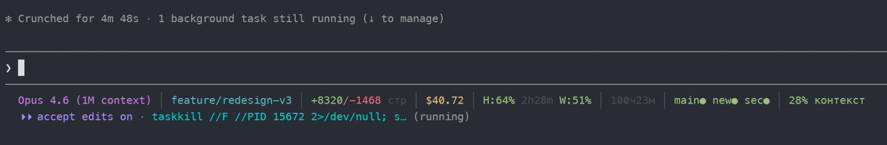
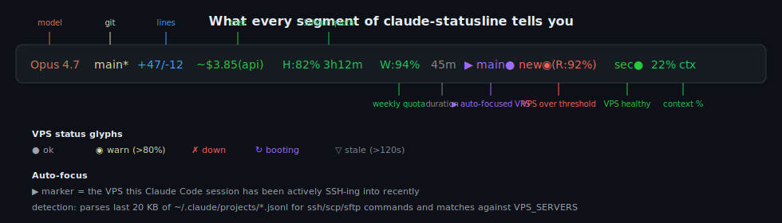
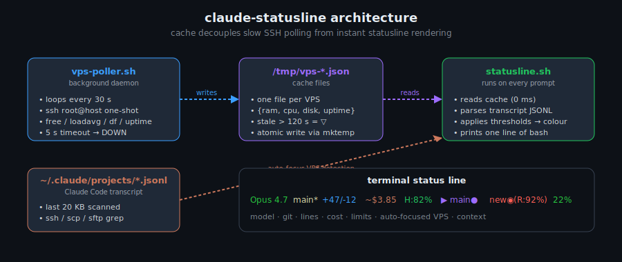

# claude-statusline

[](LICENSE)
[](https://github.com/CreatmanCEO/claude-statusline/stargazers)
[](https://github.com/CreatmanCEO/claude-statusline/actions/workflows/validate.yml)
[](https://habr.com/ru/articles/1013414/)
[](https://code.claude.com)
[](https://www.gnu.org/software/bash/)
[](#платформы)

🇷🇺 Русский · [🇬🇧 English](README.md)

**Умная статус-строка для [Claude Code](https://code.claude.com) — модель, стоимость, контекст, лимиты, здоровье VPS — всё одним взглядом, не выходя из потока. Чистый bash + `jq`, без Node.js.** *Описание дизайна и фичи авто-фокуса — в [статье на Хабре (9.3K чтений)](https://habr.com/ru/articles/1013414/).*



> Выше: реальный кадр 100-часовой сессии Opus — 8320 строк кода, $40 «сэкономлено» подпиской Max, RAM/диск трёх VPS одним взглядом. Скриншот из [статьи на Хабре](https://habr.com/ru/articles/1013414/).

## Что значит каждый сегмент



| Сегмент | Пример | Что значит |
|---|---|---|
| Модель | `Opus 4.7` | Текущая модель |
| Git | `main*` | Ветка + индикатор «грязного» дерева |
| Строки | `+47/-12` | Добавлено/удалено за сессию |
| Стоимость | `~$3.85(api)` | Теоретическая API-цена (для подписчиков) или реальная (для API-юзеров) |
| 5-часовая квота | `H:82% 3h12m` | Остаток + время до сброса |
| Недельная квота | `W:94%` | Остаток 7-дневной квоты |
| Длительность | `45m` | Время сессии |
| VPS | `▶ main● new◉(R:92%) sec●` | Здоровье серверов с авто-фокусом на активный |
| Контекст | `22% ctx` | Зелёный → жёлтый (50%) → красный (70%, время `/compact`) |

## Архитектура

Главное архитектурное решение — **развязать медленный SSH-опрос и мгновенный рендеринг статус-строки через кэш в `/tmp`.** Statusline запускается на каждом промпте Claude Code — он не может позволить себе блокировку на 5-секундном SSH-таймауте.



| Компонент | Роль |
|---|---|
| `vps-poller.sh` | Фоновый демон. Цикл каждые 30 с, один SSH на сервер, выполняет `free / loadavg / df / uptime`, атомарно пишет `/tmp/vps-<name>.json`. SSH-таймаут 5 с → DOWN. |
| `/tmp/vps-*.json` | Кэш. По одному файлу на VPS. Маркер «устаревшее > 120 с». |
| `statusline.sh` | Запускается на каждом промпте Claude Code. Читает кэш (~0 мс), парсит последние 20 КБ `~/.claude/projects/*.jsonl` для `ssh`/`scp`/`sftp`-команд (определяет активный VPS), применяет цветовые пороги, печатает одну строку bash. |
| `~/.claude/projects/*.jsonl` | Transcript Claude Code. Используется для **авто-фокуса**: тот VPS, в который агент только что подключался, получает маркер `▶` с расширенными метриками RAM/Disk. |

## Установка

Открой Claude Code (`claude` в терминале) и скажи:

```
Клонируй https://github.com/CreatmanCEO/claude-statusline и установи через install.sh
```

Или напрямую:

```bash
git clone https://github.com/CreatmanCEO/claude-statusline.git ~/claude-statusline && bash ~/claude-statusline/install.sh
```

Перезапусти Claude Code. Статус-строка появится автоматически.

> **Windows:** запускай из Claude Code, не из cmd/PowerShell (`.sh` нужен bash). См. [Troubleshooting](#troubleshooting) ниже.

### Опции установки

```bash
bash ~/claude-statusline/install.sh            # базовая
bash ~/claude-statusline/install.sh --vps      # + VPS-мониторинг
bash ~/claude-statusline/install.sh --ru       # русские подписи
bash ~/claude-statusline/install.sh --tmux     # tmux-интеграция (Prefix+y popup)
bash ~/claude-statusline/install.sh --minimal  # только модель + контекст
bash ~/claude-statusline/install.sh --uninstall
```

## VPS-мониторинг

Для тех, кто работает с удалёнными серверами через Bash SSH или MCP SSH — видишь здоровье VPS не переключаясь.

### Шаг 1 — добавить серверы

Скажи Claude Code:

```
Открой ~/.claude/statusline.conf и добавь:

SHOW_VPS=remote
VPS_SERVERS=(
  "prod|1.2.3.4|22|root|~/.ssh/my_key"
  "staging|5.6.7.8|22|root|~/.ssh/my_key"
)
```

### Шаг 2 — запустить поллер

```
Запусти ~/claude-statusline/vps-poller.sh start
```

Поллер крутится в фоне, опрашивает серверы каждые 30 с по SSH. Логи — в `/tmp/vps-poller.log`.

### Шаг 3 — авто-фокус активного сервера

Statusline сам определяет, с каким VPS ты сейчас работаешь, парся последние 20 КБ Claude Code transcript на `ssh`/`scp`/`sftp` и сопоставляя IP с `VPS_SERVERS`. Активный VPS получает маркер `▶` с расширенными метриками RAM/Disk:

```
main●  ▶ new●(R:58% D:68%)  sec●
```

Работает и с Bash SSH (`ssh root@1.2.3.4`), и с MCP SSH (если MCP-серверы используют те же IP). Для MCP-only сетапов, где IP не виден в transcript, добавь явный маппинг:

```bash
VPS_FOCUS=auto
VPS_MCP_MAP=(
  "prod|my-mcp-prod"
  "staging|my-mcp-staging"
)
```

**Глифы статусов:** 🟢 `●` OK · 🟠 `◉` WARN (>80%) · 🔴 `✗` DOWN · 🟣 `↻` BOOT · ⚪ `▽` STALE (кэш > 120 с)

## Лимиты использования (H/W)

`H:82% 3h12m` — остаток 5-часовой квоты + время до сброса; `W:94%` — недельной. Для подписчиков Max / Pro / Team. Цвет: зелёный > 50%, жёлтый 20–50%, красный < 20%.

Читает OAuth-токен из `~/.claude/.credentials.json` после `claude login`. Кэш 2 минуты.

> Идею взял у [@AndyShaman/claude-statusline](https://github.com/AndyShaman/claude-statusline) — спасибо за документацию OAuth API. Если нужны только лимиты без VPS-мониторинга — его версия легче.

## Конфигурация

Все настройки в `~/.claude/statusline.conf`. Изменения применяются при следующем ответе Claude Code — перезапуск не нужен.

| Параметр | Значения | Описание |
|---|---|---|
| `SHOW_MODEL` | true / false | Имя модели |
| `SHOW_COST` | true / false | API-стоимость |
| `SHOW_LIMITS` | true / false | Квоты H/W |
| `SHOW_CONTEXT` | true / false | % контекста |
| `SHOW_LINES` | true / false | Изменённые строки |
| `SHOW_DURATION` | true / false | Время сессии |
| `SHOW_GIT` | true / false | Git-ветка |
| `SHOW_TOKENS` | true / false | Сырые счётчики токенов |
| `SHOW_VPS` | false / remote / local | Режим VPS-мониторинга |
| `VPS_FOCUS` | auto / none / `<имя>` | Авто-определение активного VPS |
| `LANG_RU` | true / false | Русские подписи |
| `CONTEXT_WARN` | 50 | % контекста → жёлтый |
| `CONTEXT_CRIT` | 70 | % контекста → красный |
| `VPS_POLL_INTERVAL` | 30 | Интервал опроса (с) |
| `VPS_SSH_TIMEOUT` | 5 | Таймаут SSH — DOWN если превышен |
| `VPS_STALE_SEC` | 120 | Кэш старше — stale `▽` |
| `COST_MODEL` | auto / opus / sonnet / haiku | Селектор модели для расчёта |
| `TMUX_BRIDGE` | auto / on / off | tmux-интеграция |

Полный список с дефолтами — см. [`statusline.conf`](statusline.conf).

## Полезные команды Claude Code

- `/cost` — стоимость и токены сессии
- `/context` — детальный разбор контекстного окна
- `/compact` — сжать контекст (когда статус-строка покраснела)
- `/model sonnet` — переключить модель

## Платформы

| | Статус | Метрики | tmux |
|---|---|---|---|
| **Linux** | ✅ | ✅ | ✅ |
| **macOS** | ✅ | ✅ | ✅ |
| **Windows** (через Claude Code в Git Bash / WSL) | ✅ | ✅ | — |

## Troubleshooting

### После установки статус-строка пропала (Windows)

`.sh`-файлы не выполняются из cmd / PowerShell. Скажи Claude Code:

```
В ~/.claude/settings.json установи statusLine.command в: bash /c/Users/YOUR_NAME/.claude/statusline.sh
```

### Лимиты H/W не отображаются

1. Запусти `claude login` если не залогинен
2. Проверь что `~/.claude/.credentials.json` существует
3. Если нет — лимиты тихо пропускаются, остальное работает

### VPS показывает DOWN, хотя сервер в порядке

- Слишком жёсткий SSH-таймаут (5 с по умолчанию) на медленной сети → подними `VPS_SSH_TIMEOUT`
- Не загружен SSH-ключ → `ssh-add ~/.ssh/my_key`
- Firewall / ufw блокирует исходящие → проверь `/tmp/vps-poller.log`

### Авто-фокус выбирает не тот VPS

- Парсер смотрит последние 20 КБ transcript. После многих tool-call'ов нужный `ssh` может уйти из окна → пин вручную через `VPS_FOCUS=<имя>`
- Для MCP-only SSH (IP скрыты) → настрой `VPS_MCP_MAP`

## Ограничения

Это персональный инструмент, не managed-сервис. Честные ограничения:

- **Парсинг transcript эвристический.** Авто-фокус читает последние 20 КБ JSONL Claude Code. В длинных сессиях с интенсивным MCP-трафиком нужный `ssh`-вызов может уйти из окна. Workaround: пин через `VPS_FOCUS=<имя>`.
- **Допущение про OS credential storage.** Лимиты читаются из `~/.claude/.credentials.json`. Если Anthropic меняет формат — лимиты тихо ломаются до апдейта скрипта.
- **Требуется bash + jq.** Скрипт не запустится без `bash` (4+) и `jq`. PowerShell / fish / dash не поддерживаются. WSL — норм.
- **Глобальный SSH-таймаут.** Один медленный VPS не тормозит statusline (поллер асинхронен), но равномерно медленная сеть может вызывать мерцание DOWN/UP. Подними `VPS_SSH_TIMEOUT`.
- **Нет истории метрик.** Только текущий снимок. Для графиков — Grafana / Netdata / Prometheus. Этот инструмент отвечает «горит ли что-то **прямо сейчас**», а не «как было вчера».
- **tmux на Windows не поддерживается.** tmux под Windows в принципе хрупкий, флаг `--tmux` — только Linux/macOS.
- **Демон best-effort.** `vps-poller.sh start` — detached процесс, не systemd-юнит. После reboot хоста запускай поллер вручную (или оберни в свой `systemctl --user` юнит).

## Связанные проекты

- [Claude Code Anti-Regression Setup](https://github.com/CreatmanCEO/claude-code-antiregression-setup) — sister-репо, тот же автор. Дополняет: statusline показывает где контекст *сейчас*; anti-regression configs не дают Claude его испортить.
- [ai-context-hierarchy](https://github.com/CreatmanCEO/ai-context-hierarchy) — sister-репо. Трёхуровневая система контекста, которая натурально парится с авто-фокусом VPS (Level 0 — список серверов, statusline — кто из них горячий).
- [@AndyShaman/claude-statusline](https://github.com/AndyShaman/claude-statusline) — оригинальное вдохновение для фичи H/W лимитов; легче если нужны только квоты.
- [awesome-claude-code](https://github.com/hesreallyhim/awesome-claude-code) — кураторская подборка skills, hooks, agents.

## Сопровождающая статья

- [Habr — Как я собрал statusline для Claude Code с мониторингом VPS за одну сессию](https://habr.com/ru/articles/1013414/) — 9.3K чтений. Покрывает развязку через кэш, эвристику авто-фокуса и логику расчёта стоимости.

## Контрибьют

PR приветствуются — см. [CONTRIBUTING.md](CONTRIBUTING.md). Текущие приоритеты: пакеты для дистрибутивов (`apt`, `brew`, `dnf`), новые языковые локали, альтернативные backend'ы метрик VPS (Netdata API, Prometheus push, MCP `system_*` tools), Fish/Zsh.

## Автор

**Николай Подоляк (Nick Podolyak)** — Python-разработчик и цифровой архитектор в [CREATMAN](https://creatman.site)

- GitHub: [@CreatmanCEO](https://github.com/CreatmanCEO)
- Habr: [creatman](https://habr.com/ru/users/creatman/)
- dev.to: [@creatman](https://dev.to/creatman)

## Лицензия

[MIT](LICENSE) · Николай Подоляк
